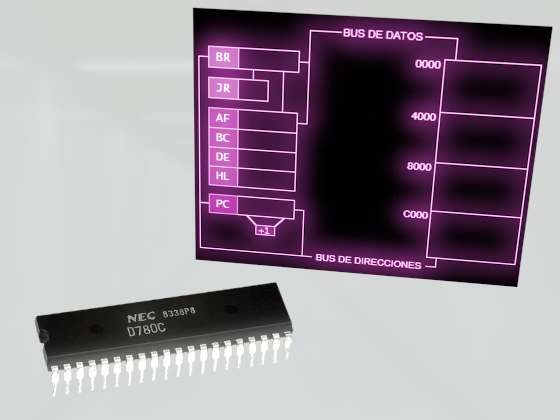
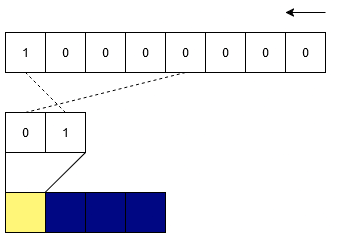

## Ciclo de ejecución de la CPU

*1t001*

El ciclo Fetch-Decode-Execute (Obtener-Decodificar-Ejecutar) es el ciclo fundamental de tres pasos que realiza un procesador para ejecutar instrucciones.

1. El procesador obtiene la siguiente instrucción a ejecutar desde la memoria. La dirección de esta instrucción se almacena en un registro especial llamado contador de programa (PC). La instrucción se copia desde la memoria al registro de instrucción (IR). El PC se incrementa para apuntar a la siguiente instrucción en la memoria.

2. El procesador decodifica la instrucción obtenida en el paso anterior. Esto significa que la CPU interpreta el código de operación de la instrucción, que especifica la operación a realizar, y identifica los operandos (datos o direcciones de memoria) en los que se realizará la operación.

3. El procesador ejecuta la instrucción decodificada. Esto puede implicar una variedad de acciones, como realizar una operación aritmética o lógica, mover datos entre registros, saltar a una dirección diferente en la memoria o leer/escribir datos desde/hacia un dispositivo de E/S.

## Instrucciones del z80

*1t007*

Son los comandos secuenciales de bajo nivel que le dicen al procesador qué hacer (manipular datos en registros y memoria).

[clrhome.org table](https://clrhome.org/table/)

### Instrucciones Comúnes

<table>
    <tr>
        <td style="color: violet;">
            3E
        </td>
        <td>
            00
        </td>
        <td style="color: violet;">
            32
        </td>
        <td>
            00FF
        </td>
         <td style="color: yellow;">
            18
        </td>
        <td>
            00FF
        </td>
    </tr>
    <tr>
        <td colspan="2">
            ld a, 00
        </td>
        <td colspan="2">
            ld (FF00), a
        </td>
        <td colspan="2">
          ld (FF00), a
        </td>
    </tr>
    <tr>
        <td style="color: cyan;">
            21
        </td>
         <td>
            00FF
        </td>
        <td style="color: cyan;">
            22
        </td>
         <td>
            00FF
        </td>
        <td></td><td></td>
    </tr>
    <tr>
        <td colspan="2">
           ld hl, FF00
        </td>
         <td colspan="2">
             ld (FF00), hl
        </td>
        <td></td><td></td>
    </tr>
</table>

Quizá se clasifiquen en grupos de acciones similares (?

## Binario y hexadecimal

*1t002, 1t003*

El sistema binario representa la forma en que las computadoras almacenan información (bi-estables). Y el hexadecimal proporciona una forma compacta y legible de representar estos números. 

*Idea: hacer calculadora didáctica en un notebook jupyter.*

### Correspondencia Directa

Cada dígito hexadecimal representa cuatro dígitos binarios (nibble).

<table class="table table-borderless table-responsive w-auto">
  <tbody>
    <tr>
      <td>0</td>
      <td>0000</td>
      <td>8</td>
      <td>1000</td>
    </tr>
    <tr>
      <td>1</td>
      <td>0001</td>
      <td>9</td>
      <td>1001</td>
    </tr>
    <tr>
      <td>2</td>
      <td>0010</td>
      <td>A</td>
      <td>1010</td>
    </tr>
    <tr>
      <td>3</td>
      <td>0011</td>
      <td>B</td>
      <td>1011</td>
    </tr>
    <tr>
      <td>4</td>
      <td>0100</td>
      <td>C</td>
      <td>1100</td>
    </tr>
    <tr>
      <td>5</td>
      <td>0101</td>
      <td>D</td>
      <td>1101</td>
    </tr>
    <tr>
      <td>6</td>
      <td>0110</td>
      <td>E</td>
      <td>1110</td>
    </tr>
    <tr>
      <td>7</td>
      <td>0111</td>
      <td>F</td>
      <td>1111</td>
    </tr>
  </tbody>
</table>

## Memoria de video

*1t004, 1t005, 1t006*

Parte de la memoria destinada a guardar la información de los píxeles en pantalla. Las imágenes están estructuradas en grupos de píxeles que el CRTC va leyendo de la memoria y enviando al monitor.

Por defecto arranca en C000 y ocupa 16000 bytes

50hz refresco, produce parpadeo (flickering)

## Formato de pixeles

Organización y entendimiento de la información guardada en memoria de video.

En amstrad hay 2 modos.

### Modo 1

Menos colores, más eficiencia.

Regla de los lados.

## Distribución de memoria de video

Antiguamente, las computadoras trataban de emular terminales, y para ello usaban ¨caracteres¨, que son dibujos pequeños que sirven para expresar letras seguidas unas de otras.

Cada caracter tiene ocho pixeles por lado.

La pantalla tiene 40 caracteres de ancho, y 25 de alto.

···

Al llenar la memoria (forma de ristra):

### Mapa de memoria de video

<table><thead>
    <tr>
        <th></th>
        <th>0</th>
        <th>1</th>
        <th>2 </th>
        <th>3</th>
        <th>4</th>
        <th>5</th>
        <th>6</th>
        <th>7</th>
    </tr></thead>
    <tbody>
        <tr>
            <th>0 </th>
            <td>C000</td>
            <td>C800</td>
            <td>D000</td>
            <td>D800</td>
            <td>E000</td>
            <td>E800</td>
            <td>F000</td>
            <td>F800</td>
        </tr>
        <tr>
            <th>8</th>
            <td>C050</td>
            <td>C850</td>
            <td>D050</td>
            <td>D850</td>
            <td>E050</td>
            <td>E850</td>
            <td>F050</td>
            <td>F850</td>
        </tr>
        <tr>
            <th>16</th>
            <td>C0A0</td>
            <td>C8A0</td>
            <td>D0A0 </td>
            <td>D8A0</td>
            <td>E0A0</td>
            <td>E8A0</td>
            <td>F0A0</td>
            <td>F8A0</td>
        </tr>
        <tr>
            <th>24</th>
            <td>C0F0</td>
            <td>C8F0</td>
            <td>D0F0 </td>
            <td>D8F0</td>
            <td>E0F0</td>
            <td>E8F0</td>
            <td>F0F0</td>
            <td>F8F0</td>
        </tr>
        <tr>
            <th>32</th>
            <td>C140</td>
            <td>C940</td>
            <td>D140</td>
            <td>D940</td>
            <td>E140</td>
            <td>E940</td>
            <td>F140</td>
            <td>F940</td>
        </tr>
        <tr>
            <th>40</th>
            <td>C190</td>
            <td>C990</td>
            <td>D190</td>
            <td>D990</td>
            <td>E190 </td>
            <td>E990</td>
            <td>F190 </td>
            <td>F990</td>
        </tr>
        <tr>
            <th>48 </th>
            <td>C1E0</td>
            <td>C9E0</td>
            <td>D1E0</td>
            <td>D9E0</td>
            <td>E1E0</td>
            <td>E9E0</td>
            <td>F1E0</td>
            <td>F9E0</td>
        </tr>
        <tr>
            <th>56</th>
            <td>C230</td>
            <td>CA30 </td>
            <td>D230</td>
            <td>DA30</td>
            <td>E230</td>
            <td>EA30</td>
            <td>F230 </td>
            <td>FA30</td>
        </tr>
        <tr>
            <th>64</th>
            <td>C280</td>
            <td>CA80</td>
            <td>D280</td>
            <td>DA80</td>
            <td>E280</td>
            <td>EA80</td>
            <td>F280</td>
            <td>FA80</td>
        </tr>
        <tr>
            <th>72</th>
            <td>C2D0</td>
            <td>CAD0</td>
            <td>D2D0</td>
            <td>DAD0</td>
            <td>E2D0</td>
            <td>EAD0</td>
            <td>F2D0</td>
            <td>FAD0</td>
        </tr>
        <tr>
            <th>80</th>
            <td>C320</td>
            <td>CB20</td>
            <td>D320</td>
            <td>DB20</td>
            <td>E320</td>
            <td>EB20</td>
            <td>F320</td>
            <td>FB20</td>
        </tr>
        <tr>
            <th>88</th>
            <td>C370</td>
            <td>CB70</td>
            <td>D370</td>
            <td>DB70</td>
            <td>E370</td>
            <td>EB70</td>
            <td>F370</td>
            <td>FB70</td>
        </tr>
        <tr>
            <th>96</th>
            <td>C3C0</td>
            <td>CBC0</td>
            <td>D3C0</td>
            <td>DBC0</td>
            <td>E3C0</td>
            <td>EBC0</td>
            <td>F3C0</td>
            <td>FBC0</td>
        </tr>
        <tr>
            <th>104</th>
            <td>C410</td>
            <td>CC10</td>
            <td>D410</td>
            <td>DC10</td>
            <td>E410</td>
            <td>EC10</td>
            <td>F410</td>
            <td>FC10</td>
        </tr>
        <tr>
            <th>112</th>
            <td>C460</td>
            <td>CC60</td>
            <td>D460</td>
            <td>DC60</td>
            <td>E460</td>
            <td>EC60</td>
            <td>F460</td>
            <td>FC60</td>
        </tr>
        <tr>
            <th>120</th>
            <td>C480</td>
            <td>CCB0</td>
            <td>D480</td>
            <td>DCB0</td>
            <td>E480</td>
            <td>ECB0</td>
            <td>F480</td>
            <td>FCB0</td>
        </tr>
        <tr>
            <th>128</th>
            <td>C500</td>
            <td>CD00</td>
            <td>D500</td>
            <td>DD00</td>
            <td>E500</td>
            <td>ED00</td>
            <td>F500</td>
            <td>FD00</td>
        </tr>
        <tr>
            <th>136</th>
            <td>C550</td>
            <td>CD50</td>
            <td>D550</td>
            <td>DD50</td>
            <td>E550</td>
            <td>ED50</td>
            <td>F550</td>
            <td>FD50</td>
        </tr>
        <tr>
            <th>144</th>
            <td>C5A0</td>
            <td>CDA0</td>
            <td>D5A0</td>
            <td>DDA0</td>
            <td>E5A0</td>
            <td>EDA0</td>
            <td>F5A0</td>
            <td>FDA0</td>
        </tr>
        <tr>
            <th>152</th>
            <td>C5F0</td>
            <td>CDF0</td>
            <td>D5F0</td>
            <td>DDF0</td>
            <td>E5F0</td>
            <td>EDF0</td>
            <td>F5F0</td>
            <td>FDF0</td>
        </tr>
        <tr>
            <th>160</th>
            <td>C640</td>
            <td>CE40</td>
            <td>D640</td>
            <td>DE40</td>
            <td>E640</td>
            <td>EE40</td>
            <td>F640</td>
            <td>FE40</td>
        </tr>
        <tr>
            <th>168</th>
            <td>C690</td>
            <td>CE90</td>
            <td>D690</td>
            <td>DE90</td>
            <td>E690</td>
            <td>EE90</td>
            <td>F690</td>
            <td>FE90</td>
        </tr>
        <tr>
            <th>176</th>
            <td>C6E0</td>
            <td>CEE0</td>
            <td>D6E0</td>
            <td>DEE0</td>
            <td>E6E0</td>
            <td>EEE0</td>
            <td>F6E0</td>
            <td>FEE0</td>
        </tr>
        <tr>
            <th>184</th>
            <td>C730</td>
            <td>CF30</td>
            <td>D730</td>
            <td>DF30</td>
            <td>E730</td>
            <td>EF30</td>
            <td>F730</td>
            <td>FF30</td>
        </tr>
        <tr>
            <th>192</th>
            <td>C780</td>
            <td>CF80</td>
            <td>D780</td>
            <td>DF80</td>
            <td>E780</td>
            <td>EF80</td>
            <td>F780</td>
            <td>FF80</td>
        </tr>
        <tr>
            <th>Sp-S </th>
            <td>C7D0 </td>
            <td>CFD0</td>
            <td>D7D0</td>
            <td>DFD0</td>
            <td>E7D0</td>
            <td>EFD0</td>
            <td>F7D0</td>
            <td>FFD0</td>
        </tr>
        <tr>
            <th>Sp-E</th>
            <td>C7FF</td>
            <td>CFFF</td>
            <td>D7FF</td>
            <td>DFFF</td>
            <td>E7FF</td>
            <td>EFFF</td>
            <td>F7FF</td>
            <td>FFFF</td>
        </tr>
    </tbody></table>

- Cada fila de pixeles ocupa 2k = 2048 dec = 800 hex

